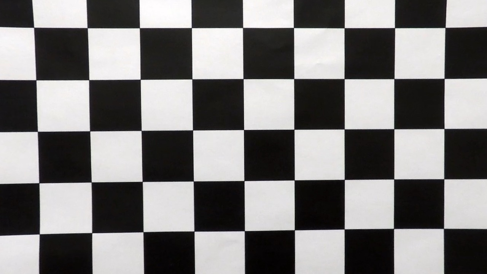
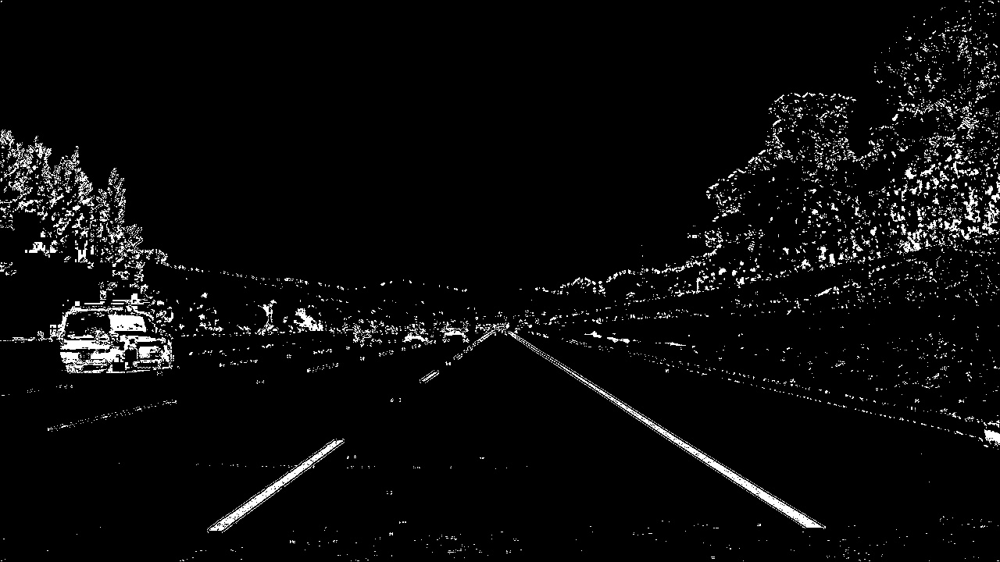
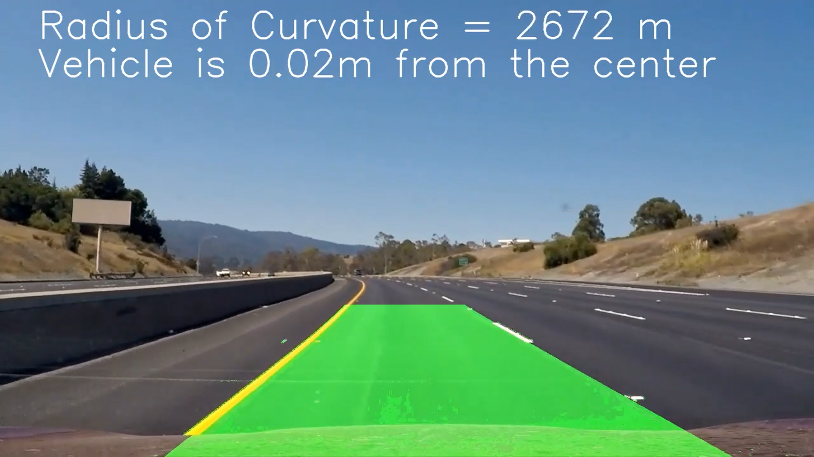

# Advanced Lane Detection Pipeline

The goals / steps of this project are the following:

* Compute the camera calibration matrix and distortion coefficients given a set of chessboard images.
* Apply a distortion correction to raw images.
* Use color transforms, gradients, etc., to create a thresholded binary image.
* Apply a perspective transform to rectify binary image ("birds-eye view").
* Detect lane pixels and fit to find the lane boundary.
* Determine the curvature of the lane and vehicle position with respect to center.
* Warp the detected lane boundaries back onto the original image.
* Output visual display of the lane boundaries and numerical estimation of lane curvature and vehicle position.

### Pipeline (single images)

#### 1. Example of a distortion-corrected image.

To demonstrate this step, I will describe how I applied the distortion correction to one of the test images like this one:


To correct the image and undistort the effects of camera, first the distortion matrix is calculate by using the inbuilt function calibratecamera. This function gives the calibration matrix, which is applied on the distorted image using undistort function. The output after applying this step is as shown.




#### 2. Applied color transforms and directional gradient thresholding to create a thresholded binary image along with an example of a binary image result.

I used a combination of color and gradient thresholds to generate a binary image  denoted by abs_sobel_thresh, mag_thresh, dir_threshold for gradient thresholding and later applying color thresholding. The input was converted from RGB color space to HLS color space. Here's an example of my output after thresholding.



#### 3. Perspective transform with an example of a transformed image.

  The `warper()` function takes as inputs an image (`img`), as well as source (`src`) and destination (`dst`) points.  I chose the hardcode the source and destination points in the following manner:

```python
x1, y1 = 220,height
x2, y2 = 550,int(2*height/3)
x3, y3 = length-550,int(2*height/3)
x4, y4 = length - 220,height
src=np.float32([[x1,y1], [x2,y2], [x3,y3], [x4,y4]])
    
dst = np.float32([[300,height], [300,0], [900,0], [900,height]])
```

This resulted in the following source and destination points:

| Source        | Destination   | 
|:-------------:|:-------------:| 
| 585, 460      | 320, 0        | 
| 203, 720      | 320, 720      |
| 1127, 720     | 960, 720      |
| 695, 460      | 960, 0        |


[alt text]: ".\output_images\warped_straight_lines.jpg" "Perspective Transform"

#### 4. Describe how (and identify where in your code) you identified lane-line pixels and fit their positions with a polynomial?

Then after the prespective transform I did worte a lane finding algorithm using a histogram approach. Along with it I also identified the lane pixels and fit my lane lines with a 2nd order polynomial kinda like this which are shown in green color:

[alt text]: ".\output_images\Color_fit_lines.jpg" "Lane pixel finding"

#### 5. Describe how (and identify where in your code) you calculated the radius of curvature of the lane and the position of the vehicle with respect to center.

After the lane finding step I wrote a algorithm for calculating the radius of curvature. It was done using a formula given in the user defined function of fit polynomial. By using the curvature formula I was able to calcuate the radius of curvature. The centre curvature of the centre of road was just the average of right and left lines. Furthermore, the amount of offset was found out by calcuating the centre of the lane and the centre of image. These two quantities were subtracted and the result was multiplied with the ratio of pixel to meter conversion given by 'xm_per_pix'. Thus giving us the Curvature value and also the offset value.  

#### 6. Result 
#### (Click the below thumbnail for complete video)
<a href="https://youtu.be/lEwCjSDabyE">  </a> 


